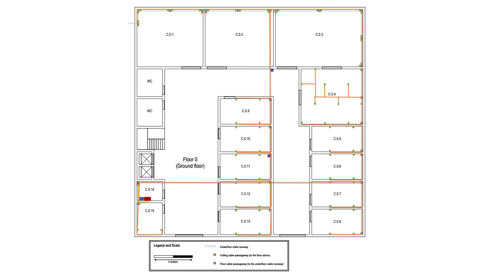
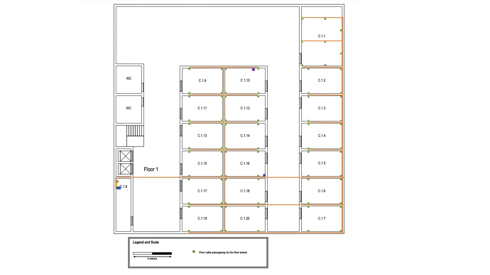

{\rtf1\ansi\ansicpg1252\cocoartf2708
\cocoatextscaling0\cocoaplatform0{\fonttbl\f0\fswiss\fcharset0 Helvetica;}
{\colortbl;\red255\green255\blue255;}
{\*\expandedcolortbl;;}
{\*\listtable{\list\listtemplateid1\listhybrid{\listlevel\levelnfc23\levelnfcn23\leveljc0\leveljcn0\levelfollow0\levelstartat1\levelspace360\levelindent0{\*\levelmarker \{hyphen\}}{\leveltext\leveltemplateid1\'01\uc0\u8259 ;}{\levelnumbers;}\fi-360\li720\lin720 }{\listname ;}\listid1}}
{\*\listoverridetable{\listoverride\listid1\listoverridecount0\ls1}}
\paperw11900\paperh16840\margl1440\margr1440\vieww37900\viewh21300\viewkind0
\pard\tx566\tx1133\tx1700\tx2267\tx2834\tx3401\tx3968\tx4535\tx5102\tx5669\tx6236\tx6803\pardirnatural\partightenfactor0

\f0\fs24 \cf0 # RCOMP - SPRINT 1 - BUILDING C\
\
##Andr\'e9 Ara\'fajo	1181155\
\
General Measurements\
\
Width: 30 meters \
\
Length : 30 meters \
\
Total Area: 900 m2\
\
------------------------------------------------------------------------------------------------------------------------\
\
# Table of contents\
1. [Schematic Plans](#schematic-plans-a-nameschemesa)\
2. [Ground Floor Measurements](#ground-floor-a-nameground_floor_ma)\
3. [First Floor Measurements](#first-floor-a-namefirst_floor_ma)\
4. [Inventory](#inventory-a-nameinventorya)\
5. [Justifications](#justifications-a-namejustificationsa)\
\
------------------------------------------------------------------------------------------------------------------------\
\
## Schematic Plans \
\
###Ground floor\
\
\
###First Floor\
\
\
------------------------------------------------------------------------------------------------------------------------\
\
## Ground floor \
\
###Room C.0.1 measurements: ###\
Specific purpose room\
\
Dimensions: 8,46m x 7,31<m\
\
Area: 61,84m2\
\
Number of network outlets: 8\
\
###Room C.0.2 measurements: ###\
Specific purpose room\
\
Dimensions: 8,85m x 7,31m\
\
Area: 64,69m2\
\
Number of network outlets: 6\
###Room C.0.3 measurements: ###\
Specific purpose room\
\
Dimensions: 11,15m x 7,31m\
\
Area: 81,50m2\
\
Number of network outlets: 10\
###Room C.0.4 measurements: ###\
\
Dimensions 8m x 7,08m\
\
Area : 56,64m2\
\
Number of network outlets: 11\
###Room C.0.5 measurements: ###\
Dimensions 6,54m x 3,23m\
\
Area : 21,12m2\
\
Number of network outlets: 4\
###Room C.0.6 measurements: ###\
Dimensions 6,54m x 3,23m\
\
Area : 21,12m2\
\
Number of network outlets: 4\
###Room C.0.7 measurements: ###\
Dimensions 6,54m x 3,23m\
\
Area : 21,12m2\
\
Number of network outlets: 4\
###Room C.0.8 measurements: ###\
Dimensions 6,54m x 3,23m\
\
Area : 21,12m2\
\
number of network outlets: 4\
###Room C.0.9 measurements: ###\
Dimensions 6,54m x 3,23m\
\
Area : 21,12m2\
\
Number of network outlets: 4\
###Room C.0.10 measurements: ###\
Dimensions 6,54m x 3,23m\
\
Area : 21,12m2\
\
Number of network outlets: 4\
###Room C0.11 measurements: ###\
Dimensions 6,54m x 3,23m\
\
Area : 21,12m2\
\
Number of network outlets: 4\
###Room C.0.12 measurements: ###\
Dimensions 6,54m x 3,23m\
\
Area : 21,12m2\
\
Number of network outlets: 4\
###Room C.0.13 measurements: ###\
Dimensions 6,54m x 3,23m\
\
Area : 21,12m2\
\
Number of network outlets: 4\
\pard\tx566\tx1133\tx1700\tx2267\tx2834\tx3401\tx3968\tx4535\tx5102\tx5669\tx6236\tx6803\pardirnatural\partightenfactor0
\cf0 ###Room C.0.14 measurements: ###\
Storage room - Houses the building IC and the ground floor HC\
\
Dimensions: 3,23m x 2,46m\
\
Area: 7,95m2\
\
\pard\tx566\tx1133\tx1700\tx2267\tx2834\tx3401\tx3968\tx4535\tx5102\tx5669\tx6236\tx6803\pardirnatural\partightenfactor0
\cf0 ###Room C0.15 measurements: ###\
Dimensions 3,23m x 4,08m\
\
Area : 13,18m2\
\
Number of network outlets: 3\
\
\
------------------------------------------------------------------------------------------------------------------------\
\
##First Floor \
\
###Room C.1.1 measurements: ###\
\
Dimensions: 5,23m x 7,62m\
\
Area: 39,85m2\
\
Number of network outlets: 8\
###Room C.1.2 measurements: ###\
\
Dimensions: 5,23m x 3,31m\
\
Area: 17,31m2\
\
Number of network outlets: 4\
###Room C.1.3 measurements: ###\
Dimensions: 5,23m x 3,31m\
\
Area: 17,31m2\
\
Number of network outlets: 4\
###Room C.1.4 measurements: ###\
Dimensions: 5,23m x 3,31m\
\
Area: 17,31m2\
\
Number of network outlets: 4\
###Room C.1.5 measurements: ###\
Dimensions: 5,23m x 3,31m\
\
Area: 17,31m2\
\
Number of network outlets: 4\
###Room C.1.6 measurements: ###\
Dimensions: 5,23m x 3,31m\
\
Area: 17,31m2\
\
Number of network outlets: 4\
###Room C.1.7 measurements: ###\
Dimensions: 5,23m x 3,31m\
\
Area: 17,312\
\
Number of network outlets: 4\
###Room C.1.8 measurements: ###\
Storage room - Houses the first floor HC\
\
Dimensions: 1,92m x 6,85m\
\
Area: 13,15m2\
\
###Room C.1.9 measurements: ###\
Dimensions: 5,23m x 3,31m\
\
Area: 17,31m2\
\
Number of network outlets: 4\
###Room C.1.10 measurements: ###\
Dimensions: 5,23m x 3,31m\
\
Area: 17,31m2\
\
Number of network outlets: 4\
###Room C.1.11 measurements: ###\
Dimensions: 5,23m x 3,31m\
\
Area: 17,31m2\
\
Number of network outlets: 4\
###Room C.1.12 measurements: ###\
Dimensions: 5,23m x 3,31m\
\
Area: 17,31m2\
\
Number of network outlets: 4\
###Room C.1.13 measurements: ###\
Dimensions: 5,23m x 3,31m\
\
Area: 17,31m2\
\
Number of network outlets: 4\
###Room C,1.14 measurements: ###\
Dimensions: 5,23m x 3,31m\
\
Area: 17,31m2\
\
Number of network outlets: 4\
###Room C.1.15 measurements: ###\
\
Dimensions: 5,23m x 3,31m\
\
Area: 17,31m2\
\
Number of network outlets: 4\
###Room C.1.16 measurements: ###\
\
Dimensions: 5,23m x 3,31m\
\
Area: 17,31m2\
\
Number of network outlets: 4\
###Room C.1.17 measurements: ###\
\
Dimensions: 5,23m x 3,31m\
\
Area: 17,31m2\
\
Number of network outlets: 4\
###Room C.1.18 measurements: ###\
\pard\tx566\tx1133\tx1700\tx2267\tx2834\tx3401\tx3968\tx4535\tx5102\tx5669\tx6236\tx6803\pardirnatural\partightenfactor0
\cf0 \
Dimensions: 5,23m x 3,31m\
\
Area: 17,31m2\
\
Number of network outlets: 4\
###Room C.1.19 measurements: ###\
\
Dimensions: 5,23m x 3,31m\
\
Area: 17,31m2\
\
Number of network outlets: 4\
###Room C.1.20 measurements: ###\
\
Dimensions: 5,23m x 3,31m\
\
Area: 17,31m2\
\
Number of network outlets: 4\
\pard\tx566\tx1133\tx1700\tx2267\tx2834\tx3401\tx3968\tx4535\tx5102\tx5669\tx6236\tx6803\pardirnatural\partightenfactor0
\cf0 \
------------------------------------------------------------------------------------------------------------------------\
## Inventory \
\
- Network outlets: 74 (ground floor) + 80 (first floor) = 154 network outlets\
\
\
- Access Points : 4\
\
\
- Copper cables: 154 (network outlets) + 4 (access points) = 158\
\
\
- Copper cable length: 2901 meters (ground floor), 2485 meters (first floor) 4meter (ceeling cable passage way) , total: 5386 meters\
\
\
- 1U - 24 connectors copper patch panels total: 8 , 4 (ground floor) + 4 (first floor)\
\
\
- Optical fibre cables : 6\
\
\
- Optical fibre cables length: 11,28 meters (ground floor) + 11,62 meters (first floor)\
\
\
- 1U optical fibre patch panel: 3\
\
\
- Patch cords: 154, total length: 770 meters\
\
\pard\tx220\tx720\tx1133\tx1700\tx2267\tx2834\tx3401\tx3968\tx4535\tx5102\tx5669\tx6236\tx6803\li720\fi-720\pardirnatural\partightenfactor0
\ls1\ilvl0\cf0 - 2 standard 19'' rack format telecommunications enclosures\
\pard\tx566\tx1133\tx1700\tx2267\tx2834\tx3401\tx3968\tx4535\tx5102\tx5669\tx6236\tx6803\pardirnatural\partightenfactor0
\cf0 \
------------------------------------------------------------------------------------------------------------------------\
## Justifications \
\
\
>### Cables \
\
The cables were layed out on the schematic plan in a way that maximizes common pathways and achieves lower cable lengths.\
\
Maximizing common pathways reduces the complexity of the scheme, it is important in order to facilitate the installation of the cables and future repairs or \
upgrades.\
\
Minimizing cable lengths is crucial in order to reduce overall costs.\
\
In the first floor the cables travel through the underfloor cable raceway.\
\
On the second floor the cables travel in the space above the dropped ceiling.\
\
### Copper Cables ####\
\
- CAT 7 copper cables are used between each outlet and each floor's horizontal cross-connect.\
\
- CAT 7 copper cables allow for higher data rates, up to 10Gbps.\
\
- T568-A copper cable wiring.\
\
- Each copper cable connecting an outlet to a horizontal cross-connect or a consolidation point is less than 90 meters \
long.\
\
### Optical Fibre Cables ####\
- Multimode optical fibre used for the backbones cabling since the distance between the ICs and the HCs are under 1000 \
meters.\
\
- There 6 fibre cables, 2 for each traject (Outside to IC, IC to ground floor HC, IC to first floor HC)\
- Each optical fibre cable has 12 fibres allowing for 6 parallel full-duplex data links.\
\
- This is to provide a safety margin over the recommended minimum of 8 fibre - 4 paralell full-duplex data links.\
\
- Each fibre cable inside the building is less than 90 meters long\
\
###Patch cords\
\
- The design expects 190 patch cords that are 5 meters long each, one for each outlet.\
\
>###Network Outlets\
\
The design follows the standard of a minimum of 2 outlets per work area and 2 outlets for each 10 square meters of area.\
\
There are in total 190 network outlets, 88 in the first floor and 102 in the second floor\
\
The outlets are strategically positioned in a way that the user can find an outlet less than 3 meters away from any\
point in a room.\
\
>### Patch Panels\
\
### Copper patch panels\
\
The plan accounts for 9 copper patch panels, 4 in the ground floor and 5 in the first floor\
\
The patch panels used are 1U - 24 connectors patch panels.\
\
In the ground floor, the patch panels will be housed in the telecommunications enclosure (TE) of the storage room \
(room D.0.15). In the first floor the patch panels will be housed in the TE of the room D.1.8 (storage room).\
\
4 patch panels are used in the ground floor in order to accomodate the 88 outlets, 2 access points of the first floor,\
along with the required connection between patch panels and the connection to the internet.\
\
5 patch panels are used in the first floor in order to accomodate the 102 outlets, 2 access points of the first floor,\
along with the required connection between patch panels and the connection to the internet.\
\
###Fibre patch panels\
\
The plan accounts for 3 fibre patch panels, one for each cross connect. Therefore 2 in the ground floor where the IC and\
the ground floor HC are located and 1 in the first floor where the first floor HC is located. \
\
>###Access Points (APs)\
\
Four access points will be used, 2 at each floor. \
\
Although using only one access point provides enough coverage for an entire floor, 2 are used in each floor for redundancy and \
also to lower the number of users connected to a single AP thus providing better performance.\
\
Each AP is located closer to the rooms that we expect a higher concentration of users.\
\
> ###Cross-connects and telecommunication enclosures\
\
There are 4 cross-connects in total, one IC for the building and one HC for each floor\
\
The scheme accounts for an HC in each floor for 3 reasons:\
\
- First reason is because a single HC should not cover an area larger than 900 m2\
\
\
- Second reason being that a telecommunications enclosure where an HC is housed should not have more than 200 cables \
entering in.\
\
\
- Third reason being the size constraints imposed by a standard 19'' rack format telecommunication enclosure.\
\
###Ground floor\
\
The room D.0.15 houses a standard 19'' rack format telecommunications enclosure which is 42U tall.\
\
This telecommunication enclosure in turn houses the IC and the ground floor HC. This TE will hold 4 copper patch panels\
and 2 fibre patch panels, together they will occupy 6U of vertical space.\
\
This is within the limits of 6 times the U units occupied by the patch panels (6*6 = 36), allowing space for the active \
equipments, the UPSs and future upgrades/expansions.\
\
Rule used: units space required for the patch panels is (S), (6 x S) U units size for the enclosure.\
  \
###First floor\
\
The room D.1.8 houses a standard 19'' rack format telecommunications enclosure which is 42U tall.\
\
This telecommunication enclosure in turn houses the ground floor HC. This TE will hold 5 copper patch panels\
and 1 fibre patch panel, together they will occupy 6U of vertical space.\
\
This is within the limits of 6 times the U units occupied by the patch panels (6*6 = 36), allowing space for the active\
equipments, the UPSs and future upgrades/expansions.\
\
Rule used: units space required for the patch panels is (S), (6 x S) U units size for the enclosure.\
\
\
}