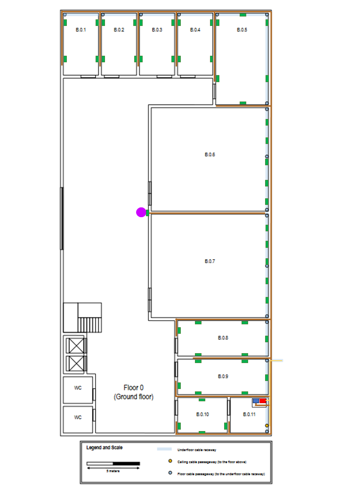
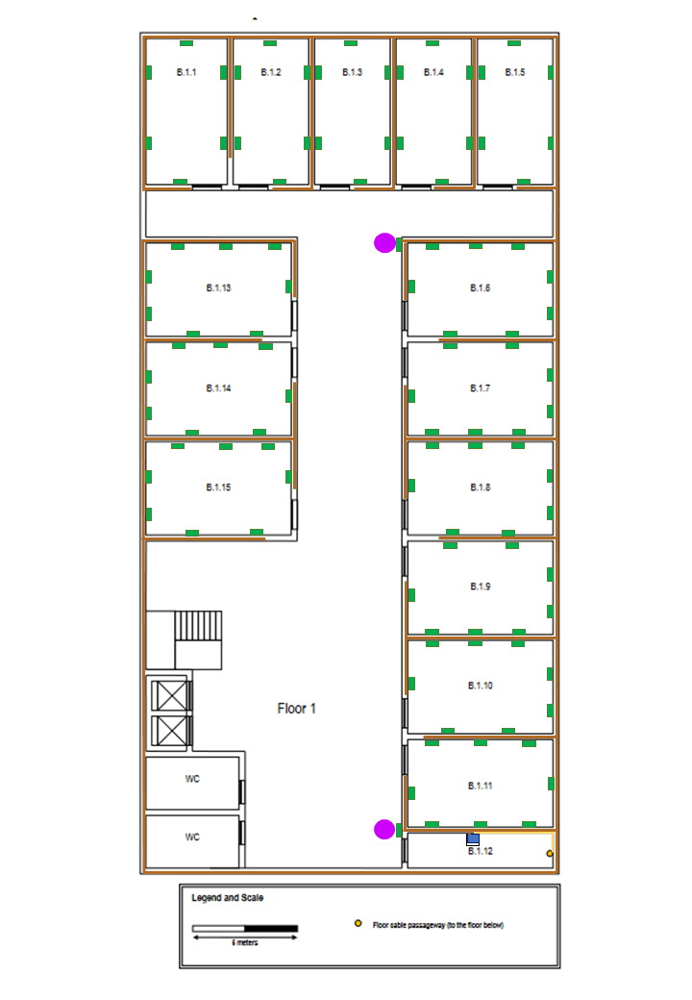

# RCOMP - SPRINT 1 - BUILDING B

##Joana Neto 1201849

General Measurements

Width: 20m

Length : 40m

Total Area:  800m2

------------------------------------------------------------------------------------------------------------------------

# Table of contents
1. [Schematic Plans](#schematic-plans-a-nameschemesa)
2. [Ground Floor Measurements](#ground-floor-a-nameground_floor_ma)
3. [First Floor Measurements](#first-floor-a-namefirst_floor_ma)
4. [Inventory](#inventory-a-nameinventorya)
5. [Justifications](#justifications-a-namejustificationsa)

------------------------------------------------------------------------------------------------------------------------

## Schematic Plans 

###Ground floor

###First Floor

------------------------------------------------------------------------------------------------------------------------

## Ground floor 

###Room B.0.1 - B.0.4 measurements: ###
Dimensions: 5,8m x 3,3m

Area: 19,1m2

Number of network outlets: 4

###Room B.0.5 measurements: ###
Dimensions: 8,5m x 5m

Area: 29m2

Number of network outlets: 6
###Room B.0.6 and B.0.7 measurements: ###
Special use rooms 

Dimensions: 11m x 9,6m

Area: 105m2

Number of network outlets: 5
###Room B.0.8 and B.0.9 measurements: ###
Dimensions 3,3m x 8,5m

Area : 28,1m2

Number of network outlets: 6
###Room B.0.10 measurements: ###
Dimensions 3,3m x 4,6m

Area : 15,2m2

Number of network outlets: 4

------------------------------------------------------------------------------------------------------------------------

##First Floor 

###Room B.1.1 measurements: ###

Dimensions: 7,1m x 4,0m

Area: 28,4m2

Number of network outlets: 6
###Room B.1.2 - B.1.5 measurements: ###

Dimensions: 7,1m x 3,8m

Area: 27,0m2

Number of network outlets: 6
###Room B.1.6 - B.1.10 and B.1.13 - B.1.15 measurements: ###
Dimensions: 4,6m x 7,1m

Area: 32,7m2

Number of network outlets: 6
###Room B.1.11 measurements: ###
Dimensions: 4,2m x 7,1m

Area: 29,9m2

Number of network outlets: 8 <- MORE THAN NEEDED BUT APPROXIMATION DEMANDS IT

------------------------------------------------------------------------------------------------------------------------
## Inventory 

- Network outlets: 60 (ground floor) + 106 (first floor) = 166 network outlets

- Access Points : 3

- Copper cables: 163 (network outlets) + 3 (access points) = 166

- Copper cable length: 1729 meters (ground floor), 4278 meters (first floor), total: 6007 meters

- 1U - 24 connectors copper patch panels total: 8 , 3 (ground floor) + 5 (first floor)

- Optical fibre cables : 6

- Optical fibre cables length: 9m (ground floor) + 5m (first floor)

- 1U optical fibre patch panel: 3

- Patch cords: 166, total length: 830 meters

- 2 standard 19'' rack format telecommunications enclosures

------------------------------------------------------------------------------------------------------------------------
## Justifications 

>### Cables 

The cables were layed out on the schematic plan in a way that maximizes common pathways and achieves lower cable lengths.

Maximizing common pathways reduces the complexity of the scheme, it is important in order to facilitate the installation of the cables and future repairs or
upgrades.

Minimizing cable lengths is crucial in order to reduce overall costs.

In the first floor the cables travel through the underfloor cable raceway.

On the second floor the cables travel in the space above the dropped ceiling.

### Copper Cables ####

- CAT 7 copper cables are used between each outlet and each floor's horizontal cross-connect.

- CAT 7 copper cables allow for higher data rates, up to 10Gbps.

- T568-A copper cable wiring.

- Each copper cable connecting an outlet to a horizontal cross-connect or a consolidation point is less than 90 meters
  long.

### Optical Fibre Cables ####
- Multimode optical fibre used for the backbones cabling since the distance between the ICs and the HCs are under 1000
  meters.

- There 6 fibre cables, 2 for each traject (Outside to IC, IC to ground floor HC, IC to first floor HC)
- Each optical fibre cable has 12 fibres allowing for 6 parallel full-duplex data links.

- This is to provide a safety margin over the recommended minimum of 8 fibre - 4 paralell full-duplex data links.

- Each fibre cable inside the building is less than 90 meters long

###Patch cords

- The design expects 166 patch cords that are 5 meters long each, one for each outlet.

>###Network Outlets

The design follows the standard of a minimum of 2 outlets per work area and 2 outlets for each 10 square meters of area.

There are in total 166 network outlets, 60 in the first floor and 106 in the second floor

The outlets are strategically positioned in a way that the user can find an outlet less than 3 meters away from any
point in a room.

>### Patch Panels

### Copper patch panels

The plan accounts for 8 copper patch panels, 3 in the ground floor and 5 in the first floor

The patch panels used are 1U - 24 connectors patch panels.

In the groundfloor, the patch panels will be housed in the telecommunications enclosure (TE) of the
room B.0.11 (storage room). In the first floor the patch panels will be housed in the TE of the room B.1.12 (storage room).

3 patch panels are used in the ground floor in order to accomodate the 60 outlets, 1 access points of the groundloor,
along with the required connection between patch panels and the connection to the internet.

5 patch panels are used in the first floor in order to accomodate the 106 outlets, 2 access points of the first floor,
along with the required connection between patch panels and the connection to the internet.

###Fibre patch panels

The plan accounts for 3 fibre patch panels, one for each cross connect. Therefore 2 in the ground floor where the IC and
the ground floor HC are located and 1 in the first floor where the first floor HC is located.

>###Access Points (APs)

Three access points will be used, 1 on the groundfloor and 2 on teh first floor.

Although using only one access point provides enough coverage for an entire floor, 2 are used in each floor for redundancy and
also to lower the number of users connected to a single AP thus providing better performance.

Each AP is located closer to the rooms that we expect a higher concentration of users.

> ###Cross-connects and telecommunication enclosures

There are 3 cross-connects in total, one IC for the building and one HC for each floor

The scheme accounts for an HC in each floor for 3 reasons:

- First reason is because a single HC should not cover an area larger than 900 m2

- Second reason being that a telecommunications enclosure where an HC is housed should not have more than 200 cables
  entering in.

- Third reason being the size constraints imposed by a standard 19'' rack format telecommunication enclosure.

###Ground floor

The room B.0.11 houses a standard 19'' rack format telecommunications enclosure which is 42U tall.

This telecommunication enclosure in turn houses the IC and the ground floor HC. This TE will hold 3 copper patch panels
and 2 fibre patch panels, together they will occupy 5U of vertical space.

This is within the limits of 6 times the U units occupied by the patch panels (6*6 = 36), allowing space for the active
equipments, the UPSs and future upgrades/expansions.

Rule used: units space required for the patch panels is (S), (6 x S) U units size for the enclosure.
  
###First floor

The room D.1.8 houses a standard 19'' rack format telecommunications enclosure which is 42U tall.

This telecommunication enclosure in turn houses the ground floor HC. This TE will hold 5 copper patch panels
and 1 fibre patch panel, together they will occupy 6U of vertical space.

This is within the limits of 6 times the U units occupied by the patch panels (6*6 = 36), allowing space for the active
equipments, the UPSs and future upgrades/expansions.

Rule used: units space required for the patch panels is (S), (6 x S) U units size for the enclosure.

