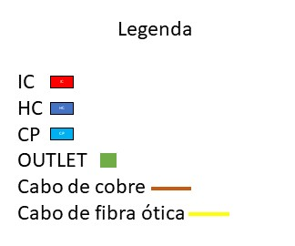

# RCOMP - SPRINT 1 - BUILDING D

Jorge Sousa - 1210820

General Measurements

Width: 30 meters

Length : 30 meters

Total Area: 900 m2

------------------------------------------------------------------------------------------------------------------------

# Table of contents
1. [Schematic Plans](#schematic-plans-a-nameschemesa)
2. [Ground Floor Measurements](#ground-floor-a-nameground_floor_ma)
3. [First Floor Measurements](#first-floor-a-namefirst_floor_ma)
4. [Inventory](#inventory-a-nameinventorya)
5. [Justifications](#justifications-a-namejustificationsa)

------------------------------------------------------------------------------------------------------------------------

## Schematic Plans 

Ground floor

First Floor

------------------------------------------------------------------------------------------------------------------------

># Ground floor 

### Room D.0.1 measurements: 

Dimensions: 5,38m x 5,38m

Area: 28,9m2

Number of network outlets: 6

### Room D.0.2 measurements: 
Specific purpose room

Dimensions: 11,54m x 11,54m

Area: 133,17m2

Number of network outlets: 12
### Room D.0.3 measurements: 

Dimensions: 6,73m x 3,27m

Area: 22m2

Number of network outlets: 6
### Room D.0.4 measurements: 

Dimensions: 6,73m x 3,27m

Area: 22m2

Number of network outlets: 6
### Room D.0.5 measurements: 

Dimensions: 6,73m x 3,27m

Area: 22m2

Number of network outlets: 6

### Room D.0.6 measurements: 

Dimensions: 6,73m x 3,27m

Area: 22m2

Number of network outlets: 6
### Room D.0.7 measurements: 

Dimensions: 6,73m x 3,27m

Area: 22m2

Number of network outlets: 6
### Room D.0.8 measurements: 

Dimensions: 6,73m x 3,27m

Area: 22m2

Number of network outlets: 6
### Room D.0.9 measurements: 

Dimensions: 6,73m x 3,27m

Area: 22m2

Number of network outlets: 6
### Room D.0.10 measurements: 

Dimensions: 6,73m x 3,27m

Area: 22m2

Number of network outlets: 6
### Room D.0.11 measurements: 

Dimensions: 6,73m x 3,27m

Area: 22m2

Number of network outlets: 6
### Room D.0.12 measurements: 
Storage Area

Dimensions: 3,85m x 3,27m

Area: 12,59m2

Number of network outlets: NULL

------------------------------------------------------------------------------------------------------------------------

># First Floor 

### Room D.1.1 measurements: 

Dimensions: 10,19m x 7,12m

Area: 72,55m2

Number of network outlets: 16
### Room D.1.2 measurements: 

Dimensions: 6,15m x 3,85m

Area: 23,68m2

Number of network outlets: 6
### Room D.1.3 measurements: 

Dimensions: 6,15m x 3,85m

Area: 23,68m2

Number of network outlets: 6
### Room D.1.4 measurements: 
Dimensions: 9,62m x 4,42m

Area: 42,52m2

Number of network outlets: 10
### Room D.1.5 measurements: 
Dimensions: 6,73m x 3,85m

Area: 25,91m2

Number of network outlets: 6
###  Room D.1.6 measurements: 
Dimensions: 6,73m x 3,85m

Area: 25,91m2

Number of network outlets: 6
### Room D.1.7 measurements: 
Dimensions: 6,73m x 3,85m

Area: 25,91m2

Number of network outlets: 6
### Room D.1.8 measurements: 
Dimensions: 6,73m x 3,85m

Area: 25,91m2

Number of network outlets: 6
### Room D.1.9 measurements: 
Dimensions: 6,73m x 3,85m

Area: 25,91m2

Number of network outlets: 6
### Room D.1.10 measurements: 
Dimensions: 6,73m x 3,85m

Area: 25,91m2

Number of network outlets: 6
### Room D.1.11 measurements: 

Dimensions: 6,15m x 3,85m

Area: 23,68m2

Number of network outlets: 6
### Room D.1.12 measurements: 

Dimensions: 6,15m x 3,85m

Area: 23,68m2

Number of network outlets: 6
### Room D.1.13 measurements: 

Dimensions: 6,15m x 3,85m

Area: 23,68m2

Number of network outlets: 6
### Room D.1.14 measurements: 

Dimensions: 6,15m x 3,85m

Area: 23,68m2

Number of network outlets: 6
### Room D.1.15 measurements: 

Dimensions: 6,15m x 3,85m

Area: 23,68m2

Number of network outlets: 6
### Room D.1.16 measurements: 

Dimensions: 6,15m x 3,85m

Area: 23,68m2

Number of network outlets: 6
### Room D.1.17 measurements: 

Dimensions: 6,15m x 3,85m

Area: 23,68m2

Number of network outlets: 6
### Room D.1.18 measurements:

Dimensions: 6,15m x 3,85m

Area: 23,68m2

Number of network outlets: 6

### Room D.1.19 measurements:
Storage Area

Dimensions: 3,46m x 1,92m

Area: 6,64m2

Number of network outlets: NULL

### Room D.1.20 measurements:
Storage Area

Dimensions: 6,54m x 1,73m

Area: 11,31m2

Number of network outlets: NULL

------------------------------------------------------------------------------------------------------------------------
>## Inventory 

- Network outlets: 72 (ground floor) + 122 (first floor) = 194 network outlets

- Copper cables Cat7A: 194 (network outlets) + 4 (access points) = 198

- Copper cable length: 2400 meters

- Singlemode Optical Fiber: 4

- Horizontal cross-connect (HC): 2

- Intermediate cross-connect (IC): 1

- Access Point (AP): 4

- Consolidation Points (CP): 10

- Patch Panel ISO 8877 of 24 ports: 8

- Patch Panel ISO 8877 of 12 ports: 2

- Patch cords: 20

- User Cords: 198

- Telecommunication Enclosures: 15

------------------------------------------------------------------------------------------------------------------------
>## Justifications 

- Taking into account the values obtained for outlets per room and the characteristics of the CPs, I decided to place them along the rooms on both floors, trying to balance the number of outlets between CPs.

- The cables were layed out on the schematic plan in a way that maximizes common pathways and achieves lower cable lengths.
  Maximizing common pathways reduces the complexity of the scheme, therefore it is important in order to facilitate the installation of the cables and future repairs or
  upgrades.
  Also, minimizing cable lengths is crucial in order to reduce overall costs.
  (In the first floor the cables travel through the underfloor cable raceway.
  On the second floor the cables travel in the space above the dropped ceiling.)

- When placing the outlets, I decided to avoid placing them next to doors, as there is a risk of the door hitting the outlet and damaging it, and it may also prove difficult to access it.
  Regarding the path of the cables, I also tried to avoid doors, as I do not know their characteristics and tried to use the smallest possible amount of cable.

- For a two-story building with dimensions of 30m x 30m, it is necessary to install at least 2 Access Points on each floor.
  As the entire space must have Wi-Fi access, 2 APs were placed closer to the lower corners of the floors, to ensure uniform coverage in all areas of the floors, considering their 15-meter radius range (attenuation of walls or other objects was taken into account).
  For the APs, different channels will be used to avoid any problems.

- The cables connecting the HC to the CPs were passed through the underground part, as it is possible to ensure that these cables are protected against damage, especially in areas where exposed wiring could be easily damaged.
In addition, this passage allows the cables to be placed in a more organized manner, facilitating maintenance and repair when necessary.

  
- Having an HC allows for easier and faster maintenance of the structured cabling system. If a problem occurs on a specific floor, maintenance can be performed on that floor without affecting the rest of the system, which can reduce downtime and minimize impact on building users.

- I decided to place the IC and one HC on the Ground Floor in room E.0.12, and the other HC in room E.1.19, as it is closer to the cable passage and its entry, allowing access to the next floor and reducing the need for more fiber optic cable.

- In room E.0.12, both were placed in the same cabinet to reduce the space required in the room to contain them and allow for greater flexibility in managing the structured cabling system, allowing for a customized configuration based on the specific needs of the building.

- To ensure the efficiency and management capability of the building's telecommunications system, the IC should be connected to a central MC (Main Cross Connect).
The MC is responsible for providing the connection to the external telecommunications network and ensuring that the fiber optic signal reaches all points in the building that require telecommunications services.
Furthermore, connecting the IC to the central MC also allows telecommunications services to be managed in a centralized and efficient manner.

  
- For Optical Fibre Cables, since all connectors and patch panels must take into consideration the cable specifications, I decided to use CAT7A, since all of them are also CAT7A. For fiber patch panels, since I decided to use singlemode, they must be compatible with singlemode.

- In choosing the number of ports for the patch panels, the number of structures that need to be connected to the CPs was considered, leaving about 25% of the total number of ports free.

- The design expects 198 patch cords that are 5 meters long each, one for each outlet.
Knowing that each 24-port patch panel occupies 1U of space and each switch also occupies 1U, for each telecommunication enclosure, it must be considered that the minimum size is 6U, that is, if it is below, it must be "rounded up" to 6U.
The total size must be multiplied by 2 before rounding up to insure future upgrade compatibility.

  

