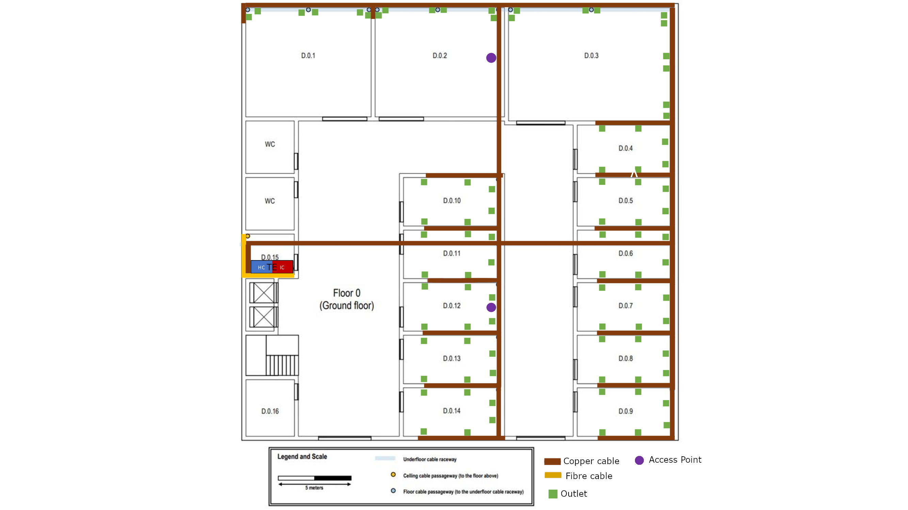
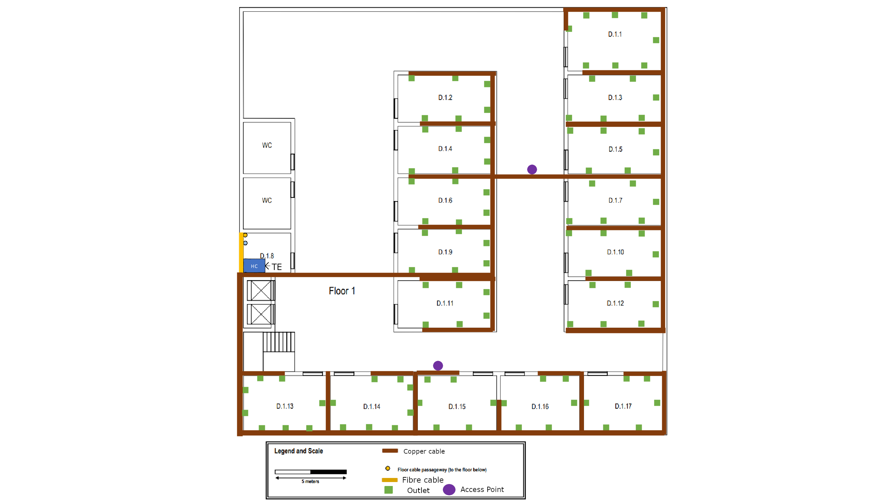

# RCOMP - SPRINT 1 - BUILDING D

##Sérgio Cardoso - 1210891

General Measurements

Width: 30 meters (836px)

Length : 30 meters (836px)

Total Area: 900 m2

------------------------------------------------------------------------------------------------------------------------

# Table of contents
1. [Schematic Plans](#schemes)
2. [Ground Floor Measurements](#ground_floor_m)
3. [First Floor Measurements](#first_floor_m)
4. [Inventory](#inventory)
5. [Justifications](#justifications)

------------------------------------------------------------------------------------------------------------------------

## Schematic Plans 

###Ground floor

###First Floor

------------------------------------------------------------------------------------------------------------------------

## Ground floor 

###Room D.0.1 measurements: ###
Specific purpose room

Dimensions: 8,6m x 7,6m

Area: 65,36m2

Number of network outlets: 6

###Room D.0.2 measurements: ###
Specific purpose room

Dimensions: 8,86m x 7,5m

Area: 66,45m2

Number of network outlets: 6
###Room D.0.3 measurements: ###
Specific purpose room

Dimensions: 11,4m x 7,82m

Area: 89m2

Number of network outlets: 10
###Room D.0.4 measurements: ###

Dimensions 6,67m x 3,37m

Area : 22,48m2

Number of network outlets: 6
###Room D.0.5 measurements: ###
Dimensions 6,67m x 3,37m

Area : 22,48m2

Number of network outlets: 6
###Room D.0.6 measurements: ###
Dimensions 6,67m x 3,37m

Area : 22,48m2

Number of network outlets: 6
###Room D.0.7 measurements: ###
Dimensions 6,67m x 3,37m

Area : 22,48m2

Number of network outlets: 6
###Room D.0.8 measurements: ###
Dimensions 6,67m x 3,37m

Area : 22,48m2

number of network outlets: 6
###Room D.0.9 measurements: ###
Dimensions 6,67m x 3,37m

Area : 22,48m2

Number of network outlets: 6
###Room D.0.10 measurements: ###
Dimensions 6,67m x 3,37m

Area : 22,48m2

Number of network outlets: 6
###Room D.0.11 measurements: ###
Dimensions 6,67m x 3,37m

Area : 22,48m2

Number of network outlets: 6
###Room D.0.12 measurements: ###
Dimensions 6,67m x 3,37m

Area : 22,48m2

Number of network outlets: 6
###Room D.0.13 measurements: ###
Dimensions 6,67m x 3,37m

Area : 22,48m2

Number of network outlets: 6
###Room D.0.14 measurements: ###
Dimensions 6,67m x 3,37m

Area : 22,48m2

Number of network outlets: 6
###Room D.0.15 measurements: ###
Storage room - Houses the building IC and the ground floor HC

Dimensions: 2,58m x 2,76m

Area: 7,12m2

###Room D.0.16 measurements: ###
Storage room

Dimensions: 3,88m x 3,27m

Area: 12,69m2

------------------------------------------------------------------------------------------------------------------------

##First Floor 

###Room D.1.1 measurements: ###

Dimensions: 7,82m x 4,9m

Area: 38,3m2

Number of network outlets: 8
###Room D.1.2 measurements: ###

Dimensions: 7,82m x 3,9m

Area: 30m2

Number of network outlets: 6
###Room D.1.3 measurements: ###
Dimensions: 7,82m x 3,9m

Area: 30m2

Number of network outlets: 6
###Room D.1.4 measurements: ###
Dimensions: 7,82m x 3,9m

Area: 30m2

Number of network outlets: 6
###Room D.1.5 measurements: ###
Dimensions: 7,82m x 3,9m

Area: 30m2

Number of network outlets: 6
###Room D.1.6 measurements: ###
Dimensions: 7,82m x 3,9m

Area: 30m2

Number of network outlets: 6
###Room D.1.7 measurements: ###
Dimensions: 7,82m x 3,9m

Area: 30m2

Number of network outlets: 6
###Room D.1.8 measurements: ###
Storage room - Houses the first floor HC

Dimensions: 3,88m x 3,3m

Area: 12,8m2

###Room D.1.9 measurements: ###
Dimensions: 7,82m x 3,9m

Area: 30m2

Number of network outlets: 6
###Room D.1.10 measurements: ###
Dimensions: 7,82m x 3,9m

Area: 30m2

Number of network outlets: 6
###Room D.1.11 measurements: ###
Dimensions: 7,82m x 3,9m

Area: 30m2

Number of network outlets: 6
###Room D.1.12 measurements: ###
Dimensions: 7,82m x 3,9m

Area: 30m2

Number of network outlets: 6
###Room D.1.13 measurements: ###
Dimensions: 6,82m x 4,56m

Area: 31,1m2

Number of network outlets: 8
###Room D.1.14 measurements: ###
Dimensions: 6,82m x 4,56m

Area: 31,1m2

Number of network outlets: 8
###Room D.1.15 measurements: ###

Dimensions: 6,53m x 4,56m

Area: 30m2

Number of network outlets: 6
###Room D.1.16 measurements: ###

Dimensions: 6,53m x 4,56m

Area: 30m2

Number of network outlets: 6
###Room D.1.17 measurements: ###

Dimensions: 6,53m x 4,56m

Area: 30m2

Number of network outlets: 6

------------------------------------------------------------------------------------------------------------------------
## Inventory 

- Network outlets: 88 (ground floor) + 102 (first floor) = 190 network outlets

- Access Points : 4

- Copper cables: 190 (network outlets) + 4 (access points) = 194

- Copper cable length: 3333 meters (ground floor), 3994 meters (first floor), total: 7327 meters

- 1U - 24 connectors copper patch panels total: 9 , 4 (ground floor) + 5 (first floor)

- Optical fibre cables : 6

- Optical fibre cables length: 300 meters (MC to the building IC) -  11,28 meters (ground floor) + 11,62 meters (first floor) - total: 323 meters.

- 1U optical fibre patch panel: 3

- Patch cords: 190, total length: 950 meters

- 2 standard 19'' rack format telecommunications enclosures

------------------------------------------------------------------------------------------------------------------------
## Justifications 

>### Cables 

The cables were layed out on the schematic plan in a way that maximizes common pathways and achieves lower cable lengths.

Maximizing common pathways reduces the complexity of the scheme, it is important in order to facilitate the installation of the cables and future repairs or 
upgrades.

Minimizing cable lengths is crucial in order to reduce overall costs.

In the first floor the cables travel through the underfloor cable raceway.

On the second floor the cables travel in the space above the dropped ceiling.

### Copper Cables ####

- CAT 7 copper cables are used between each outlet and each floor's horizontal cross-connect.

- CAT 7 copper cables allow for higher data rates, up to 10Gbps.

- T568-A copper cable wiring.

- Each copper cable connecting an outlet to a horizontal cross-connect or a consolidation point is less than 90 meters 
long.

### Optical Fibre Cables ####
- Multimode optical fibre used for the backbones cabling since the distance between the ICs and the HCs are under 1000 
meters.

- There 6 fibre cables, 2 for each traject (Outside to IC, IC to ground floor HC, IC to first floor HC)
- Each optical fibre cable has 12 fibres allowing for 6 parallel full-duplex data links.

- This is to provide a safety margin over the recommended minimum of 8 fibre - 4 paralell full-duplex data links.

- Each fibre cable inside the building is less than 90 meters long

###Patch cords

- The design expects 190 patch cords that are 5 meters long each, one for each outlet.

>###Network Outlets

The design follows the standard of a minimum of 2 outlets per work area and 2 outlets for each 10 square meters of area.

There are in total 190 network outlets, 88 in the first floor and 102 in the second floor

The outlets are strategically positioned in a way that the user can find an outlet less than 3 meters away from any
point in a room.

>### Patch Panels

### Copper patch panels

The plan accounts for 9 copper patch panels, 4 in the ground floor and 5 in the first floor

The patch panels used are 1U - 24 connectors patch panels.

In the ground floor, the patch panels will be housed in the telecommunications enclosure (TE) of the storage room 
(room D.0.15). In the first floor the patch panels will be housed in the TE of the room D.1.8 (storage room).

4 patch panels are used in the ground floor in order to accomodate the 88 outlets, 2 access points of the first floor,
along with the required connection between patch panels and the connection to the internet.

5 patch panels are used in the first floor in order to accomodate the 102 outlets, 2 access points of the first floor,
along with the required connection between patch panels and the connection to the internet.

###Fibre patch panels

The plan accounts for 3 fibre patch panels, one for each cross connect. Therefore 2 in the ground floor where the IC and
the ground floor HC are located and 1 in the first floor where the first floor HC is located. 

>###Access Points (APs)

Four access points will be used, 2 at each floor. 

Although using only one access point provides enough coverage for an entire floor, 2 are used in each floor for redundancy and 
also to lower the number of users connected to a single AP thus providing better performance.

Each AP is located closer to the rooms that we expect a higher concentration of users.

> ###Cross-connects and telecommunication enclosures

There are 4 cross-connects in total, one IC for the building and one HC for each floor

The scheme accounts for an HC in each floor for 3 reasons:

- First reason is because a single HC should not cover an area larger than 900 m2

- Second reason being that a telecommunications enclosure where an HC is housed should not have more than 200 cables 
entering in.

- Third reason being the size constraints imposed by a standard 19'' rack format telecommunication enclosure.

###Ground floor

The room D.0.15 houses a standard 19'' rack format telecommunications enclosure which is 42U tall.

This telecommunication enclosure in turn houses the IC and the ground floor HC. This TE will hold 4 copper patch panels
and 2 fibre patch panels, together they will occupy 6U of vertical space.

This is within the limits of 6 times the U units occupied by the patch panels (6*6 = 36), allowing space for the active 
equipments, the UPSs and future upgrades/expansions.

Rule used: units space required for the patch panels is (S), (6 x S) U units size for the enclosure.
  
###First floor

The room D.1.8 houses a standard 19'' rack format telecommunications enclosure which is 42U tall.

This telecommunication enclosure in turn houses the ground floor HC. This TE will hold 5 copper patch panels
and 1 fibre patch panel, together they will occupy 6U of vertical space.

This is within the limits of 6 times the U units occupied by the patch panels (6*6 = 36), allowing space for the active
equipments, the UPSs and future upgrades/expansions.

Rule used: units space required for the patch panels is (S), (6 x S) U units size for the enclosure.

