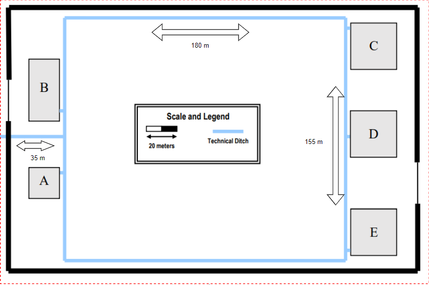

# Schematic implementation plans

> The Main cross-connect (MC) is situated on the first floor of Building A and will link up with the Intermediate 
cross-connects (ICs) in each building through two separate fiber optic cables. The two cables connecting to each IC will
have distinct routes to split the data transmission, leading to an improvement in network performance. Additionally, if 
one of the cables experiences a failure, the network will remain operational, as the other cable will function as a 
backup (fail-over). The cables follow diverse paths to prevent the scenario where both cables are damaged at the same
time.

## Outdoor fiber optic cable length to MC

> 35 + 22,5 + 8,80 = 66,30 meters

 

