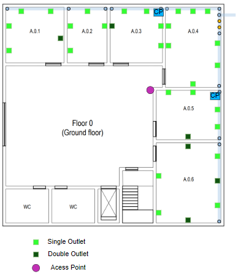
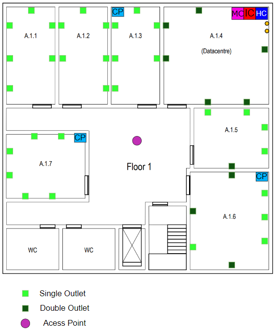
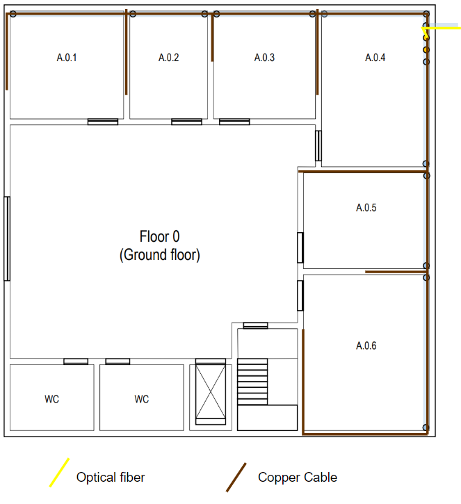
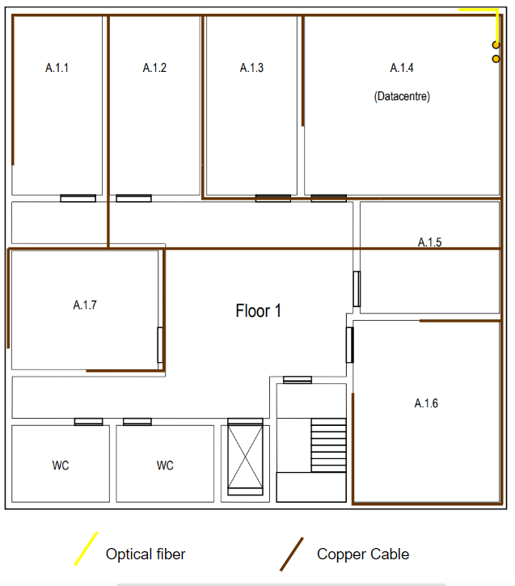

# RCOMP - SPRINT 1 - BUILDING A

### Measurements

- Width: 20 meters

- Length : 20 meters 

> Total Area: 400 m2

>Outlet density: standard - minimum 2 outlets per room and 2 outlets per 10m2

### Relevant Information

> This building holds the datacentre (room A.1.4), it will also house the main cross-connect for the
structured cabling system.

> Both floors must have wireless LAN coverage (Wi-Fi).

> The ground floor has an underfloor cable raceway connected to the external technical ditch. The ceiling height on this floor is 4 meters. Common areas, like the entrance hall, restrooms, and stairs,
require no network outlets.

> The first floor has a removable dropped ceiling, placed 2.5
meters from the ground, covering the entire floor. The space over the dropped ceiling is perfect to install
cable raceways and wireless access-points, this floor has no underfloor cable raceways. No network outlets are required at restrooms and common areas like corridors and halls. Elsewhere, in
every identified room, the standard number of network outlets per area rate should be honoured.

------------------------------------------------------------------------------------------------------------------------

## Ground floor ##

**Room A.0.1 measurements:**

- Dimensions: 5,0m x 5,17m

- Area: 25,85m2

- Number of network outlets: 6

**Room A.0.2 measurements:**

- Dimensions: 5,0m x 3,45m

- Area: 17,252

- Number of network outlets: 4

**Room A.0.3 measurements:**

- Dimensions: 5,0m x 4,66m

- Area: 23,3m2

- Number of network outlets: 6

**Room A.0.4 measurements:**

- Dimensions 7,07m x 5,0m

- Area : 35,35m2

- Number of network outlets: 8

**Room A.0.5 measurements:**

- Dimensions 4,31m x 5,59m

- Area : 21,55m2

- Number of network outlets: 6 

**Room A.0.6 measurements:** 

- Dimensions 7,07m x 5,59m

- Area : 40,23m2

- Number of network outlets: 10

------------------------------------------------------------------------------------------------------------------------

## First Floor ##

**Room A.1.1 measurements:**

- Dimensions: 7,07 x 3,62m

- Area: 25,85m2

- Number of network outlets: 6

**Room A.1.2 measurements:**

- Dimensions: 7,07 x 3,62m

- Area: 25,85m2

- Number of network outlets: 6

**Room A.1.3 measurements:**

- Dimensions: 7,07 x 3,62m

- Area: 25,85m2

- Number of network outlets: 6

**Room A.1.4 (Datacentre) measurements:**

- Dimensions 7,07m x 5,0m

- Area : 54,86m2

- Number of network outlets: 12

**Room A.1.5 measurements:**

- Dimensions 4,31m x 5,34m

- Area : 23,01m2

- Number of network outlets: 6

**Room A.1.6 measurements:**

- Dimensions 7,07m x 5,59m

- Area : 40,23m2

- Number of network outlets: 10

**Room A.1.7 measurements:**

- Dimensions 4,66m x 5,69m

- Area : 26,52m2

- Number of network outlets: 6

------------------------------------------------------------------------------------------------------------------------
## Cable specifications ##

### Copper Cables ###

>CAT 7 copper cables are used between each outlet and each floor's horizontal cross-connect.

>CAT 7 copper cables allow for higher data rates, up to 10Gbps.

>T568-A copper cable wiring.

>Each copper cable connecting an outlet to a horizontal cross-connect or a consolidation point is less than 90 meters
long.

### Optical Fibre Cables ###
>Multimode optical fibre used for the backbones cabling since the distance between the ICs and the HCs are under 1000
meters.

>Each optical fibre cable has 12 fibres allowing for 6 parallel full-duplex data links.

>This is to provide a safety margin over the recommended minimum of 8 fibre - 4 paralell full-duplex data links.

>Each fibre cable inside the building is less than 90 meters long

------------------------------------------------------------------------------------------------------------------------

# Schematic implementation plans

## Distribution of network outlets (*outlets*), AP's (*Access-points*), CP's (*Consolidation Points*)

### Ground Floor

> 28 Single Outlets + 6 Double Outlets = 40 Outlets
 
> 1 Access Point

### First Floor

> 32 Single Outlets + 10 Double Outlets = 52 Outlets

> 1 Access Point

### Comments

- The **mains sockets** are placed **0.5 meters** from the ground

- The design follows the standard of a minimum of 2 outlets per work area and 2 outlets for each 10 square meters of area.

- The **CP's (*Consolidation Points*)** are placed in such a way as to reduce the total amount of cable needed to connect to all network outlets

- With the exception of common areas such as bathrooms, hallways, and entryways, all rooms are equipped with electrical outlets.

- No storage area has been designated on this floor, resulting in the absence of a horizontal cross-connect (HC). As a result, the HC on the first floor will be utilized by both floors. This arrangement is feasible because the network sockets on the ground floor are located within 90 meters of the HC, allowing for interconnection via cables of the appropriate length.

- To avoid placing outlets behind doors, I used double outlets to comply with the required number of outlets per room.

- On this floor, every CP is connected to the HC on the 1st floor via two cables, each following a distinct path. This
approach splits the data transmission, leading to enhanced network performance. Additionally, if one of the cables 
fails, the network will remain functional, as the other cable will serve as a backup (fail-over). The cables follow
diverse routes to prevent the occurrence of both cables being damaged simultaneously in the event of any harm to
one of the passages.

- The **CPs** are placed **1.5 meters** from the ground

- **Access points** are placed on the ceiling

- The **Outlets** are positioned at a height of 0.5 meters from the ground.

  

## Cable system planning 

### Ground Floor

### First Floor

### Cable Count

- Cable between HC and CP/AP (Ground Floor) :  ~ 90 m
- Cable between HC and CP/AP (First Floor) : ~ 100 m
- Cable Optical Fibre between MC and Exterior : ~ 10 m
- Copper Cable Ground Floor: ~ 470 m
- Copper Cable Floor 1 : ~ 505 m

### Comments

- Only one fiber optic cable is taken into account in this context, which links the MC to the exterior.

------------------------------------------------------------------------------------------------------------------------

# Inventory

- 60 Single Outlets

- 16 Double Outlets

- 92 Patch Cord (Total Lenght: 460)

- Approximately 1165 m Copper Cable

- Approximately 10 m Cable Optical Fibre

- 5 Consolidation Points

- 1 Main Cross Connect

- 1 Intermediate Cross-Connect

  - 1 Horizontal Cross-Connect

