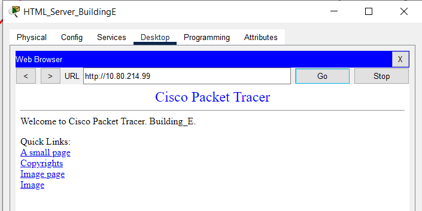
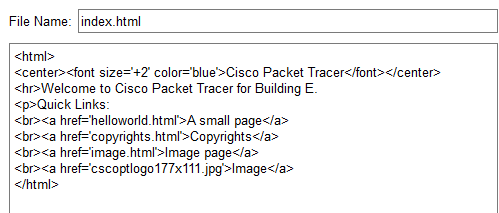
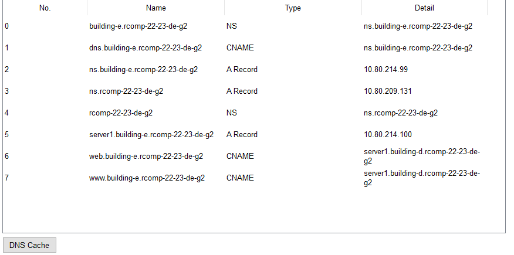

# SPRINT 3 - Building E #

Jorge Sousa - 1210820

##1. OSPF Dynamic Routing

The OSPF area for the building E is the area 5.
The backbone network (area 0) was also added to the OSPF dynamic routing configuration.

<b>OSPF logs:</b>

router ospf 1

log-adjacency-changes

network 10.80.212.192 0.0.0.63 area 5 (BE_GF Network)
network 10.80.212.0 0.0.0.63 area 5 (BE_FF Network)
network 10.80.211.0 0.0.0.127 area 5 (BE_WiFi Network)
network 10.80.214.96 0.0.0.31 area 5 (BE_VoIP Network)
network 10.80.214.32 0.0.0.31 area 5 (BE_DMZ Network)
network 10.80.209.0 0.0.0.127 area 0 (Backbone Network)

## 2. HTTP Servers ##

A new server was added to the local DMZ Network.

It is accessible by its IP: 10.80.214.99.

## 3. DHCPv4 Service ##

The DHCPv4 service is configured and enabled for all the networks belonging to building E except for the DMZ network
that has static IPs.

## 4. VoIP Service

Ip source-address 10.80.214.34 which is the IP associated with the router VoIP sub-interface.

2 phones are included in the simulation:

ephone-dn 1
number 5001

ephone-dn 2
number 5002

The phones used in the simulation are CISCO IP phones 7960, the voice vlan is enabled and the access vlan disabled.

VoIP call forwarding between buildings is enabled and fully operation and follows the patterns outlined in the planning
document.

## 5. DNS ##

DNS configuration is fully established in building E as per the requirements.

Please refer to the image/table below:

## 6. NAT ##

In this sprint static NAT was used to redirect traffic.

HTTP and HTTPS requests received in the router's backbone interface are redirected to the HTTP server in the local DMZ,
they (HTTP and HTTPS) use TCP connections with the default ports 80 and 443.

DNS requests received in the router’s backbone interface are redirected to the DNS server in the local
DMZ. 

## 7. Static Firewall (ACLs)

Firewall requirements were not fully met and all work done for this is in the config of the router belonging to Building E.

