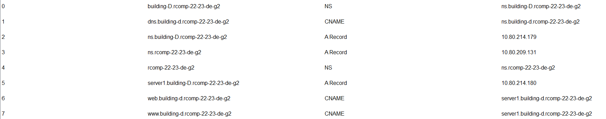

# SPRINT 3 - Building D #

Sérgio Cardoso - 1210891

##1. OSPF Dynamic Routing

The OSPF area for the building D is the area 4. 

All networks belonging to the building D were added to the area 4.

The backbone network (area 0) was also added to the OSPF dynamic routing configuration.

<b>OSPF logs:</b>

router ospf 1

log-adjacency-changes

network 10.80.214.0 0.0.0.31 area 4 (BD_GF Network)

network 10.80.211.192 0.0.0.63 area 4 (BD_FF Network)

network 10.80.210.0 0.0.0.127 area 4 (BD_WiFi Network)

network 10.80.214.144 0.0.0.15 area 4 (BD_VoIP Network)

network 10.80.214.176 0.0.0.15 area 4 (BD_DMZ Network)

network 10.80.209.0 0.0.0.127 area 0 (Backbone Network)

## 2. HTTP Servers ##

A new server was added to the local DMZ Network.

It is accessible by its IP: 10.80.214.180 or by "www.building-d.rcomp-22-23-de-g2" or "web.building-d.rcomp-22-23-de-g2" (See DNS part below).

## 3. DHCPv4 Service ##

The DHCPv4 service is configured and enabled for all the networks belonging to building D except for the DMZ network 
that has static IPs.

For the VoIP network the configuration includes option 150:

option 150 ip 10.80.214.146

## 4. VoIP Service

ip source-address 10.80.214.146 port 2000 - which is the IP associated with the router VoIP sub-interface.

The pattern for phone numbers of building D is 4. . .

2 phones are included in the simulation:

ephone-dn 1
number 4000

ephone-dn 2
number 4001

The phones used in the simulation are CISCO IP phones 7960, the voice vlan is enabled and the access vlan disabled.

VoIP call forwarding between buildings is enabled and fully operation and follows the patterns outlined in the planning
document.

## 5. DNS ##

DNS configuration is fully established in building D as per the requirements.

Please refer to the image/table below:

## 6. NAT ##

In this sprint static NAT was used to redirect traffic.

HTTP and HTTPS requests received in the router's backbone interface are redirected to the HTTP server in the local DMZ, 
they (HTTP and HTTPS) use TCP connections with the default ports 80 and 443.

DNS requests received in the router’s backbone interface are redirected to the DNS server in the local
DMZ. DNS service can use either UDP or TCP, the default port is 53.

All this cases are covered with the lines below:

ip nat inside source static tcp 10.80.214.180 80 10.80.209.5 80
ip nat inside source static tcp 10.80.214.180 443 10.80.209.5 443
ip nat inside source static tcp 10.80.214.179 53 10.80.209.5 53
ip nat inside source static udp 10.80.214.179 53 10.80.209.5 53 

10.80.214.180 is the HTTP server IP address
10.80.214.178 is the DNS server IP address

## 7. Static Firewall (ACLs)

The enforcement of Access Control Lists follows the precedence specified in the sprint document.

Please refer to the IC_Router_D running configuration in the configuration dump and the excel with the IP addresses 
to have full understanding of the firewall configuration in building D. 

