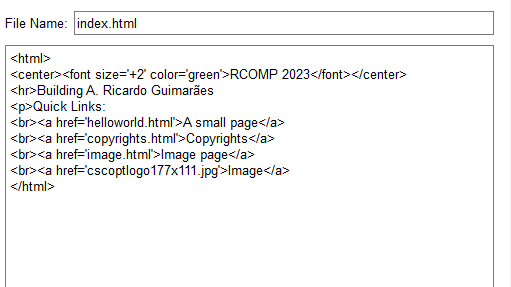
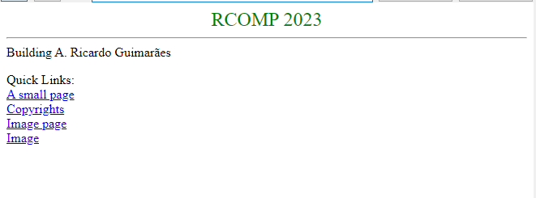
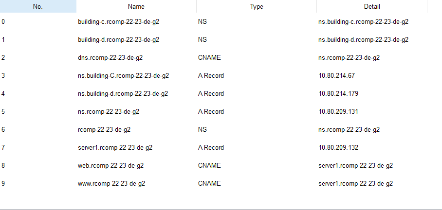

# Projeto RCOMP 2022-2023 - Sprint 3 - Membro 1212125

## Edifício A

###  1. OSPF Dynamic Routing

#### *Configuração*

>router ospf 1 
> 
> log-adjacency-changes 
> 
> redistribute static subnets 
> 
> redistribute connected subnets 
> 
> network 10.80.213.0 0.0.0.63 area 1 
> 
> network 10.80.210.128 0.0.0.127 area 1 
> 
> network 10.80.208.128 0.0.0.127 area 1 
> 
> network 10.80.209.128 0.0.0.127 area 1 
> 
> network 10.80.213.128 0.0.0.63 area 1 
> 
> network 10.80.209.0 0.0.0.127 area 0

### 2. HTTP Servers

#### Endereço do servidor HTTP:

* 10.80.209.132

#### Página web (*index.html*) - código fonte:

#### Página web (*index.html*) - pré-visualização:

### 3. DHCPv4 Service

#### Network pools:

#### Piso 0:

* ip dhcp pool BA_GF
* network 10.80.213.0 255.255.255.192
* default-router 10.80.213.1
* dns-server 10.80.209.131
* domain-name rcomp-22-23-de-g2

#### Piso 1:

* ip dhcp pool BA_FF
* network 10.80.210.128 255.255.255.128 
* default-router 10.80.210.129 
* dns-server 10.80.209.131 
* domain-name rcomp-22-23-de-g2

#### Wi-Fi:

* ip dhcp pool BA_WiFi 
* network 10.80.208.128 255.255.255.128 
* default-router 10.80.208.129 
* dns-server 10.80.209.131 
* domain-name rcomp-22-23-de-g2

#### VoIP: 

* ip dhcp pool BA_VoIP 
* network 10.80.213.128 255.255.255.192 
* option 150 ip 10.80.213.129

#### Exclusão dos IPs das sub-interfaces do *router*

- ip dhcp excluded-address 10.80.213.1 10.80.213.2
- ip dhcp excluded-address 10.80.210.129 10.80.210.130
- ip dhcp excluded-address 10.80.208.129 10.80.208.130
- ip dhcp excluded-address 10.80.213.129 10.80.213.130

### 4. Configuração do  VoIP phone

>telephony-service
> 
>ephones 6
>
>max-dn 100
> 
>ip source-address 10.80.213.128 port 2000
> 
>auto assign 1 to 2

#### Telefone 1 (1000):

>ephone 1
> 
>device-security-mode none
> 
>mac-address 0060.4779.DD53
> 
>type 7960
> 
>button 1:1

#### Telefone 2 (1001):

>ephone 2
> 
>device-security-mode none
> 
>mac-address 0010.1124.647A
> 
>type 7960
> 
>button 1:2

### 5. DNS (Domain Name System)

#### Endereço IPv4 do servidor DNS

10.80.209.132

#### Configuração do servidor DNS

### 6. NAT (Network Address Translation)

#### Redirecionamento HTTP

>ip nat inside source static tcp 10.80.209.132 80 10.80.209.2 80
> 
>ip nat inside source static tcp 10.80.209.132 443 10.80.209.2 443

#### Redirecionamento DNS

> ip nat inside source static tcp 10.80.209.131 53 10.80.209.2 53
>
>ip nat inside source static udp 10.80.209.131 53 10.80.209.2 53 

### 7. Static Firewall (ACLs)

------------------------------------------------------------------------------------------------------------------------
#### Configuração da Vlan do Ground Floor

    no access-list 100										//reset

    access-list 100 deny ip any host 10.80.213.1            //Bloquear sub-interface GF
    access-list 100 deny ip any host 10.80.210.129          //Bloquear sub-interface FF
    access-list 100 deny ip any host 10.80.213.129          //Bloquear sub-interface VoIP
    access-list 100 deny ip any host 10.80.209.129          //Bloquear sub-interface DMZ
    access-list 100 deny ip any host 10.80.208.129          //Bloquear sub-interface Wi-Fi
    access-list 100 deny ip any host 10.80.209.2            //Bloquear sub-interface backbone

    access-list 100 permit tcp 10.80.213.0 0.0.0.63 host 10.80.209.132 eq 80      //permitir http porta 80
    access-list 100 permit tcp 10.80.213.0 0.0.0.63 host 10.80.209.132 eq 443     //permitir http porta 443
    access-list 100 permit tcp 10.80.213.0 0.0.0.63 host 10.80.209.131 eq 53      //permitir http porta 80
    access-list 100 permit udp 10.80.213.0 0.0.0.63 host 10.80.209.131 eq 53      //permitir http porta 443
    access-list 100 deny ip any 10.80.209.2 0.0.7.255                             //negar acesso rede DMZ

    access-list 100 permit ip 10.80.213.0 0.0.0.63 any                //internal spoofing
    access-list 100 permit icmp any any echo-reply                    //permitir ICMP
    access-list 100 permit ip any any                                 //desbloquear restantes comunicações
    
    interface Fa1/0.2
    ip access-group 100 in
------------------------------------------------------------------------------------------------------------------------
#### Configuração da Vlan do First Floor

    no access-list 101										//reset

    access-list 101 deny ip any host 10.80.213.1            //Bloquear sub-interface GF
    access-list 101 deny ip any host 10.80.210.129          //Bloquear sub-interface FF
    access-list 101 deny ip any host 10.80.213.129          //Bloquear sub-interface VoIP
    access-list 101 deny ip any host 10.80.209.129          //Bloquear sub-interface DMZ
    access-list 101 deny ip any host 10.80.208.129          //Bloquear sub-interface Wi-Fi
    access-list 101 deny ip any host 10.80.209.2            //Bloquear sub-interface backbone

    access-list 101 permit tcp 10.80.210.128 0.0.0.127 host 10.80.209.132 eq 80      //permitir http porta 80
    access-list 101 permit tcp 10.80.210.128 0.0.0.127 host 10.80.209.132 eq 443     //permitir http porta 443
    access-list 101 permit tcp 10.80.210.128 0.0.0.127 host 10.80.209.131 eq 53      //permitir http porta 80
    access-list 101 permit udp 10.80.210.128 0.0.0.127 host 10.80.209.131 eq 53      //permitir http porta 443
    access-list 101 deny ip any 10.80.209.2 0.0.7.255                             //negar acesso rede DMZ

    access-list 101 permit ip 10.80.210.128 0.0.0.127 any                //internal spoofing
    access-list 101 permit icmp any any echo-reply                     //permitir ICMP
    access-list 101 permit ip any any                                  //desbloquear restantes comunicações
    
    interface Fa1/0.3
    ip access-group 101 in
------------------------------------------------------------------------------------------------------------------------
#### Configuração da Vlan Do VoIP

    no access-list 102										//reset

    access-list 102 deny ip any host 10.80.213.1            //Bloquear sub-interface GF
    access-list 102 deny ip any host 10.80.210.129          //Bloquear sub-interface FF
    access-list 102 deny ip any host 10.80.213.129          //Bloquear sub-interface VoIP
    access-list 102 deny ip any host 10.80.209.129          //Bloquear sub-interface DMZ
    access-list 102 deny ip any host 10.80.208.129          //Bloquear sub-interface Wi-Fi
    access-list 102 deny ip any host 10.80.209.2            //Bloquear sub-interface backbone

    access-list 102 permit tcp 10.80.213.128 0.0.0.31 host 10.80.209.132 eq 80      //permitir http porta 80
    access-list 102 permit tcp 10.80.213.128 0.0.0.31 host 10.80.209.132 eq 443     //permitir http porta 443
    access-list 102 permit tcp 10.80.213.128 0.0.0.31 host 10.80.209.131 eq 53      //permitir http porta 80
    access-list 102 permit udp 10.80.213.128 0.0.0.31 host 10.80.209.131 eq 53      //permitir http porta 443
    access-list 102 deny ip any 10.80.209.2 0.0.7.255                               //negar acesso rede DMZ

    access-list 102 permit ip 10.80.213.128 0.0.0.31 any                //internal spoofing
    access-list 102 permit icmp any any echo-reply                      //permitir ICMP
    access-list 102 permit ip any any                                   //desbloquear restantes comunicações
    
    interface Fa1/0.6
    ip access-group 102 in
------------------------------------------------------------------------------------------------------------------------
#### Configuração da Vlan Do Wi-Fi

    no access-list 103										//reset

    access-list 103 deny ip any host 10.80.213.1            //Bloquear sub-interface GF
    access-list 103 deny ip any host 10.80.210.129          //Bloquear sub-interface FF
    access-list 103 deny ip any host 10.80.213.129          //Bloquear sub-interface VoIP
    access-list 103 deny ip any host 10.80.209.129          //Bloquear sub-interface DMZ
    access-list 103 deny ip any host 10.80.208.129          //Bloquear sub-interface Wi-Fi
    access-list 103 deny ip any host 10.80.209.2            //Bloquear sub-interface backbone

    access-list 103 permit tcp 10.80.208.128 0.0.0.127 host 10.80.209.132 eq 80      //permitir http porta 80
    access-list 103 permit tcp 10.80.208.128 0.0.0.127 host 10.80.209.132 eq 443     //permitir http porta 443
    access-list 103 permit tcp 10.80.208.128 0.0.0.127 host 10.80.209.131 eq 53      //permitir http porta 80
    access-list 103 permit udp 10.80.208.128 0.0.0.127 host 10.80.209.131 eq 53      //permitir http porta 443
    access-list 103 deny ip any 10.80.209.2 0.0.7.255                                //negar acesso rede DMZ

    access-list 103 permit ip 10.80.208.128 0.0.0.127 any                //internal spoofing
    access-list 103 permit icmp any any echo-reply                       //permitir ICMP
    access-list 103 permit ip any any                                    //desbloquear restantes comunicações
    
    interface Fa1/0.4
    ip access-group 103 in
------------------------------------------------------------------------------------------------------------------------
#### Configuração da Vlan Do BackBone

    no access-list 104										//reset

    access-list 104 deny ip 10.80.209.0 0.0.7.255 any           //external spoofing (rede global do edifício A)

    access-list 104 deny ip any host 10.80.213.1            //Bloquear sub-interface GF
    access-list 104 deny ip any host 10.80.210.129          //Bloquear sub-interface FF
    access-list 104 deny ip any host 10.80.213.129          //Bloquear sub-interface VoIP
    access-list 104 deny ip any host 10.80.209.129          //Bloquear sub-interface DMZ
    access-list 104 deny ip any host 10.80.208.129          //Bloquear sub-interface Wi-Fi

    access-list 104 permit tcp any host 10.80.209.132 eq 80      //permitir http porta 80
    access-list 104 permit tcp any host 10.80.209.132 eq 443      //permitir http porta 443
    access-list 104 permit tcp any host 10.80.209.131 eq 53      //permitir http porta 80
    access-list 104 permit udp any host 10.80.209.131 eq 53      //permitir http porta 443
    access-list 104 deny ip any 10.80.209.2 0.0.7.255            //negar acesso rede DMZ

    access-list 104 permit icmp any any echo-reply                       //permitir ICMP
    access-list 104 permit ip any any                                    //desbloquear restantes comunicações
    
    interface Fa1/0.1
    ip access-group 104 in